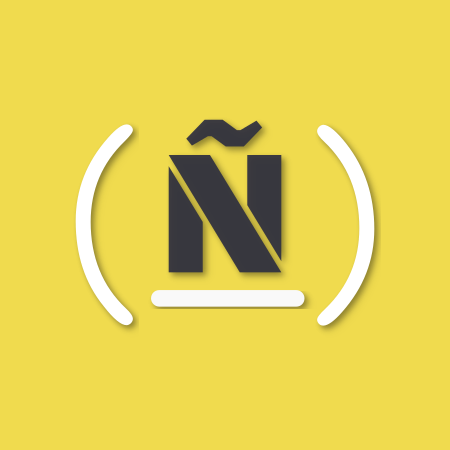

# Recursos de FreeCodeHispano

FreeCodeHispano es un grupo de usuarios de freeCodeCamp que nos conocimos en el chat
de [FreeCodeCamp/Espanol](https://gitter.im/FreeCodeCamp/Espanol) y que ante la falta
de grupos locales activos en nuestras inmediaciones, decidimos empezar a realizar
**quedadas** a través de internet.

Este repositorio ha sido creado por los miembros de FCH principalmente para 
compartir recursos relacionados con el curriculum que estamos
estudiando en la plataforma [FreeCodeCamp](http://www.freecodecamp.com/). Aunque nuestro
principal enfoque es aportar recursos que ayuden a completar FCC, es posible que el contenido
que  aquí albergamos, pueda ser de utilidad a cualquier persona que esté aprendiendo desarrollo web y
JavaScript. Por lo que no necesitas ser usuario de FCC para utilizar estos recursos.

En este repositorio encontrarás enlaces para:

* Libros
* MOOCs
* Blog posts
* Podcasts
* Material creado por nuestros miembros

Si quieres unirte y hablar con nosotros, entra en nuestro [canal de Gitter](https://github.com/fchispano)

Además, si quieres contribuír con el repositorio, [aquí](./CONTRIBUTING.md) te explicamos cómo.
No te preocupes, no es nada complicado ;).
